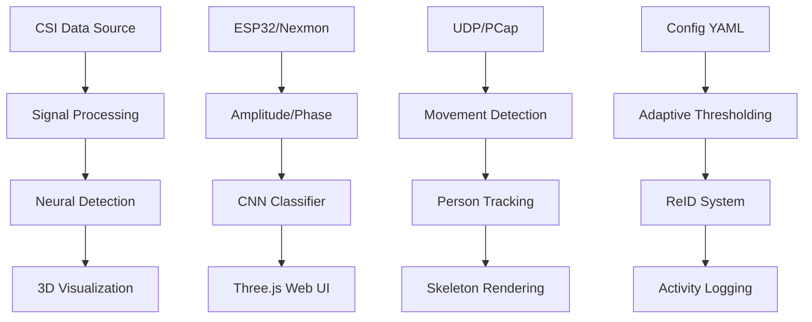

# WiFi-3D-Fusion


## 🚀 Quick Start Guide

### Hardware Requirements
- **Single Device**: Developed using a **dual-band USB WiFi adapter with the Realtek RTL8812AU chipset** (ideal for Nexmon) **OR** an **ESP32 with CSI firmware**.
- Linux system (Ubuntu 22.04+ recommended).
- Optional: CUDA-capable GPU for faster training.


### Method 1: Web-Based Real-Time Visualization (Recommended)
```bash
# Install dependencies
bash scripts/install_all.sh

# Start web-based real-time visualization
source venv/bin/activate
python run_js_visualizer.py

# Open browser to http://localhost:5000
```

### Method 2: Traditional Pipeline
```bash
# ESP32-CSI UDP (default port 5566):
./scripts/run_realtime.sh --source esp32

# Or Nexmon (requires monitor-mode interface)
sudo ./scripts/run_realtime.sh --source nexmon
```

## 🎯 Model Training & Continuous Learning

### Train Your Own Detection Model
```bash
# Basic training with current configuration
./train_wifi3d.sh

# Quick training session with continuous learning
./train_wifi3d.sh --quick --continuous

# Train with specific device source
./train_wifi3d.sh --source esp32 --device cuda --epochs 200

# Enable continuous learning (model improves automatically)
./train_wifi3d.sh --continuous --auto-improve

# Advanced training with custom parameters
./train_wifi3d.sh \
    --source nexmon \
    --device cuda \
    --epochs 500 \
    --batch-size 64 \
    --lr 0.0005 \
    --continuous \
    --auto-improve
```

### Continuous Learning Features
- **Real-time model improvement**: The system automatically learns from new detections
- **Adaptive training**: Model updates based on detection confidence and user feedback  
- **Self-improvement**: System gets better at person detection over time
- **Background learning**: Training happens continuously without interrupting visualization

## 📊 System Architecture & Features

### Core Components
1. **CSI Data Acquisition**
   - ESP32-CSI via UDP (recommended for beginners)
   - Nexmon firmware on Broadcom chips (advanced users)
   - Real-time CSI amplitude and phase extraction

2. **Advanced Detection Pipeline**
   - Convolutional Neural Network for person detection
   - Real-time skeleton estimation and tracking
   - Multi-person identification and re-identification (ReID)
   - Adaptive movement threshold adjustment

3. **3D Visualization System**
   - Web-based Three.js renderer with professional UI
   - Real-time 3D skeleton visualization
   - Animated CSI noise patterns on ground plane
   - Interactive camera controls and HUD overlays

4. **Machine Learning Features**
   - Continuous learning during operation
   - Automatic model improvement based on feedback
   - Self-adaptive detection thresholds
   - Person re-identification across sessions

### Real-Time Pipeline Flow


## 🛠️ Installation & Setup

### Prerequisites
- Linux system (Ubuntu 18.04+ recommended)
- Python 3.8+
- WiFi adapter with monitor mode support (for Nexmon)
- ESP32 with CSI firmware (for ESP32 mode)
- CUDA-capable GPU (optional, improves training speed)

### Complete Installation
```bash
# Clone repository
git clone https://github.com/MaliosDark/wifi-3d-fusion.git
cd wifi-3d-fusion

# Install all dependencies and setup environment
bash scripts/install_all.sh

# Activate Python environment
source venv/bin/activate

# Verify installation
python -c "import torch, numpy, yaml; print('✅ All dependencies installed')"
```

### Hardware Setup

> **Note**: See [WiFi Adapter, Driver, and Monitor Mode Setup](#wifi-adapter-driver-and-monitor-mode-setup-rtl8812au-example) for detailed RTL8812AU configuration.

#### Option A: ESP32-CSI Setup
1. **Flash ESP32 with CSI firmware**
   ```bash
   # Download ESP32-CSI-Tool firmware
   # Flash to ESP32 using esptool or Arduino IDE
   ```

2. **Configure ESP32**
   - Set WiFi network and password
   - Configure UDP target IP (your PC's IP)
   - Set UDP port to 5566 (or modify `configs/fusion.yaml`)

3. **Update configuration**
   ```yaml
   # configs/fusion.yaml
   source: esp32
   esp32_udp_port: 5566
   ```

#### Option B: Nexmon Setup
1. **Install Nexmon firmware**
   ```bash
   # For Raspberry Pi 4 with bcm43455c0
   git clone https://github.com/seemoo-lab/nexmon_csi.git
   cd nexmon_csi
   # Follow installation instructions for your device
   ```

2. **Enable monitor mode**
   ```bash
   sudo ip link set wlan0 down
   sudo iw dev wlan0 set type monitor
   sudo ip link set wlan0 up
   ```

3. **Update configuration**
   ```yaml
   # configs/fusion.yaml  
   source: nexmon
   nexmon_iface: wlan0
   ```

## 🎮 Running the System

### Web-Based Visualization (Recommended)
```bash
# Start the web server with real-time visualization
source venv/bin/activate
python run_js_visualizer.py

# Optional: specify device source
python run_js_visualizer.py --source esp32
python run_js_visualizer.py --source nexmon

# Access web interface
# Open browser to: http://localhost:5000
```

### Traditional Terminal-Based
```bash
# Run with default configuration
./run_wifi3d.sh

# Run with specific source
./run_wifi3d.sh esp32
./run_wifi3d.sh nexmon

# Run with custom channel hopping (Nexmon only)
sudo IFACE=mon0 HOP_CHANNELS=1,6,11 python run_realtime_hop.py
```

### Training Mode
```bash
# Collect training data first by running the system
python run_js_visualizer.py

# Train model on collected data
bash train_wifi3d.sh --epochs 100 --device cuda

# Train with continuous learning enabled
bash train_wifi3d.sh --continuous --auto-improve

# Resume training from checkpoint
bash train_wifi3d.sh --resume env/weights/checkpoint_epoch_50.pth
```

## 📋 Configuration

### Main Configuration File: `configs/fusion.yaml`
```yaml
# CSI Data Source
source: esp32                    # esp32, nexmon, or dummy
esp32_udp_port: 5566            # UDP port for ESP32
nexmon_iface: wlan0             # Network interface for Nexmon

# Detection Parameters  
movement_threshold: 0.002        # Sensitivity for movement detection
debounce_seconds: 0.3           # Minimum time between detections
win_seconds: 3.0                # CSI analysis window size

# 3D Visualization
scene_bounds: [[-2,2], [-2,2], [0,3]]  # 3D scene boundaries
rf_res: 64                      # RF field resolution
alpha: 0.6                      # Visualization transparency

# Machine Learning
enable_reid: true               # Enable person re-identification
reid:
  checkpoint: env/weights/who_reid_best.pth
  seq_secs: 2.0                # Sequence length for ReID
  fps: 20.0                    # Processing framerate

# Advanced Features  
enable_pose3d: false            # 3D pose estimation (experimental)
enable_nerf2: false             # Neural RF fields (experimental)
```

## 🔧 Advanced Features

### Continuous Learning System
The system includes an advanced continuous learning pipeline that:

1. **Monitors detection confidence** in real-time
2. **Automatically collects training samples** from high-confidence detections  
3. **Updates the model** in the background without interrupting visualization
4. **Adapts detection thresholds** based on environment characteristics
5. **Improves person re-identification** over time

### Model Training Pipeline
```python
# Example: Custom training script
from train_model import WiFiTrainer, TrainingConfig

# Configure training
config = TrainingConfig(
    batch_size=64,
    learning_rate=0.001,  
    epochs=200,
    continuous_learning=True,
    auto_improvement=True
)

# Initialize trainer
trainer = WiFiTrainer('configs/fusion.yaml', args)

# Start training with continuous learning
trainer.train()
```

### Real-Time Performance Optimization
- **Multi-threaded processing**: Separate threads for data acquisition, processing, and visualization
- **Adaptive frame rates**: Automatically adjusts processing speed based on system load
- **Memory management**: Efficient CSI buffer management for long-running sessions
- **GPU acceleration**: CUDA support for neural network inference and training

## 🌐 Web Interface Features

<p align="center">
  
</p>

### Responsive Dashboard
- **Real-time CSI metrics**: Signal variance, amplitude, activity levels
- **Person detection status**: Count, confidence, positions
- **Skeleton visualization**: 3D animated skeletons with joint tracking
- **System performance**: FPS, memory usage, processing time
- **Activity logging**: Real-time event log with timestamps

### Interactive 3D Scene
- **Manual camera controls**: Orbit, zoom, pan with mouse
- **Ground noise visualization**: Animated circular wave patterns
- **Skeleton rendering**: Full 3D human skeletons for detected persons
- **Real-time updates**: Live data streaming at 10 FPS

<p align="center">
  
</p>

### Dashboard Component Panels

<p align="center">
   
</p>
<p align="center">
  <b>System Performance Metrics</b> (left) and <b>CSI Signal Analytics</b> (right)
</p>

### HUD Information Panels

<p align="center">
  
</p>


### Validate Model Performance
```bash
# Evaluate trained model
python tools/eval_reid.py --checkpoint env/weights/best_model.pth

# Record test sequences
python tools/record_reid_sequences.py --duration 60

# Simulate CSI data for testing
python tools/simulate_csi.py --samples 1000
```

## 📊 Data Collection & Management

### CSI Data Storage
```
env/
├── csi_logs/              # Raw CSI data files (*.pkl)
├── logs/                  # System and training logs  
├── weights/               # Trained model checkpoints
└── visualization/         # Web interface files
    ├── index.html         # Main dashboard
    ├── js/app.js         # Visualization logic
    └── css/style.css     # UI styling
```

### Training Data Organization
```
data/
├── reid/                  # Person re-identification data
│   ├── person_000/       # Individual person sequences
│   ├── person_001/
│   └── ...
├── splits/               # Training/validation splits
│   ├── train.txt
│   ├── val.txt  
│   └── gallery.txt
└── logs/                 # Training history and metrics
```

## 🚨 Troubleshooting

### Common Issues

#### 1. No CSI Data Received
```bash
# Check ESP32 connection
ping <ESP32_IP>

# Verify UDP port
netstat -ulnp | grep 5566

# Test with dummy data
python run_js_visualizer.py --source dummy
```

#### 2. Monitor Mode Issues (Nexmon)
```bash
# Reset interface
sudo ip link set wlan0 down
sudo iw dev wlan0 set type managed  
sudo ip link set wlan0 up

# Re-enable monitor mode
sudo ip link set wlan0 down
sudo iw dev wlan0 set type monitor
sudo ip link set wlan0 up
```

#### 3. Training Fails
```bash
# Check GPU availability
python -c "import torch; print(torch.cuda.is_available())"

# Reduce batch size for limited memory
bash train_wifi3d.sh --batch-size 16

# Use CPU training
bash train_wifi3d.sh --device cpu
```

#### 4. Web Interface Issues
```bash
# Check if server is running
curl http://localhost:5000/data

# Clear browser cache and reload
# Check browser console for JavaScript errors (F12)

# Restart server
pkill -f run_js_visualizer.py
python run_js_visualizer.py
```

### Debug Logging
Enable verbose logging for troubleshooting:
```bash
# Set debug mode
export WIFI3D_DEBUG=1

# Run with verbose output
python run_js_visualizer.py --verbose

# Check log files
tail -f env/logs/wifi3d_*.log
```
---

## Optional bridges (disabled by default)

### 1) Person-in-WiFi-3D (3D pose)

* Repo: `third_party/Person-in-WiFi-3D-repo`
* Enable in `configs/fusion.yaml`: `enable_pose3d: true`
* Place a compatible checkpoint at `env/weights/pwifi3d.pth`.
* Prepare test data under the repo’s expected structure (`data/wifipose/test_data/...`), then run:

  ```bash
  python -m src.bridges.pwifi3d_runner \
    third_party/Person-in-WiFi-3D-repo config/wifi/petr_wifi.py env/weights/pwifi3d.pth
  ```

  *(We shell out to OpenMMLab’s `tools/test.py` inside the repo.)*

### 2) NeRF² (RF field)

* Repo: `third_party/NeRF2`
* Enable in `configs/fusion.yaml`: `enable_nerf2: true`
* Train:

  ```bash
  python -m src.bridges.nerf2_runner
  ```

### 3) 3D Wi-Fi Scanner (RSSI volume)

* Repo: `third_party/3D_wifi_scanner`
* Use that tooling to generate volumetric RSSI datasets; you can integrate them into your own fusion pipeline if desired.

---

## Configuration

Edit `configs/fusion.yaml`:

* `source: esp32 | nexmon`
* `esp32_udp_port`, `nexmon_iface`, etc.
* Detector thresholds: `movement_threshold`, `win_seconds`, `debounce_seconds`.

---

## Docker

```bash
docker compose build
docker compose run --rm fusion
```

---

## Notes

* For **Nexmon**, you need `tcpdump` privileges. The Dockerfile includes it; on host, install it and run as root/sudo.
* For **Person-in-WiFi-3D**, follow that repo’s requirements (PyTorch, MMCV/MMDet). Our `scripts/install_all.sh` installs compatible versions.
* For **ESP32-CSI**, UDP JSON payloads compatible with common forks are supported.

---

### Usage (super short)

### Adaptive monitor-mode pipeline (recommended for RTL8812AU, Nexmon, or any monitor-mode interface)
```bash
sudo -E env PATH="$PWD/venv/bin:$PATH" IFACE=mon0 HOP_CHANNELS=1,6,11 python3 run_realtime_hop.py
```
This will launch the self-learning pipeline described above.


If you want the Docker path:

```bash
docker compose build
docker compose run --rm fusion
```
---

## 🔧 System Requirements & Dependencies

* **OS:** Ubuntu 22.04+ (tested with Kernel 6.14)
* **Python:** 3.12 (venv managed by `scripts/install_all.sh`)
* **GPU:** Optional (only for Pose3D/NeRF² bridges)
* **Packages (auto-installed):**

  * Base: `numpy`, `pyyaml`, `loguru`, `tqdm`, `open3d`, `opencv-python`, `einops`, `watchdog`, `pyzmq`, `matplotlib`, `csiread==1.4.1`
  * Optional Pose3D: `torch` + `torchvision` (cu118/cu121 or cpu), `openmim`, `mmengine`, `mmcv`, `mmdet`
* **System tools for capture (optional):** `tcpdump`, `tshark/wireshark`, `aircrack-ng`, `iw`

> The installer keeps Torch/`openmim` on **default PyPI** (no PyTorch index bleed) and pins `csiread` to a wheel compatible with Python 3.12.

---

## 🛠️ WiFi Adapter, Driver, and Monitor Mode Setup (RTL8812AU Example)

### Supported Adapters
This project was developed using a **dual-band USB WiFi adapter with the Realtek RTL8812AU chipset**, which supports both 2.4 GHz and 5 GHz bands, monitor mode, and packet injection. This adapter is widely used for WiFi security research and is compatible with Linux distributions such as Ubuntu, Kali, and Parrot. Other Nexmon-compatible adapters or ESP32 with CSI firmware are also supported.

### Driver Installation (RTL8812AU)

The default kernel driver may not provide full monitor mode support. For best results, install the latest driver from the [aircrack-ng/rtl8812au](https://github.com/aircrack-ng/rtl8812au) repository:

```bash
sudo apt update
sudo apt install dkms git build-essential
git clone https://github.com/aircrack-ng/rtl8812au.git
cd rtl8812au
sudo make dkms_install
```

This will build and install the driver for your current kernel, enabling reliable monitor mode and packet capture.

### Enabling Monitor Mode

After installing the driver, connect your RTL8812AU adapter and identify its interface name (e.g., `wlx...`):

```bash
iw dev
iwconfig
```

To enable monitor mode and create a `mon0` interface:

```bash
sudo airmon-ng check kill
sudo airmon-ng start <your-interface>
# Or manually:
sudo ip link set <your-interface> down
sudo iw dev <your-interface> set type monitor
sudo ip link set <your-interface> up
```

Verify monitor mode:

```bash
iwconfig
```
You should see `Mode:Monitor` for `mon0` or your chosen interface.

### Verifying Packet Capture

To confirm that your interface is capturing WiFi packets in monitor mode:

```bash
sudo airodump-ng mon0
sudo tcpdump -i mon0
```

You should see networks and packets. If not, ensure there is active WiFi traffic in your environment.

### Additional Tools

For debugging and traffic generation, you may also want to install:

```bash
sudo apt install aircrack-ng tcpdump tshark
```

---

## 🧑‍💻 Running the Real-Time Pipeline with Monitor Mode

### Prerequisites
1. **WiFi adapter in monitor mode** (see setup instructions above)
2. **Virtual environment activated**
3. **All dependencies installed**

### Step-by-Step Execution

1. **Activate the virtual environment:**
```bash
source venv/bin/activate
```

2. **Setup monitor interface (if not already done):**
```bash
sudo bash scripts/setup_monitor.sh
```

3. **Verify monitor mode is working:**
```bash
sudo iwconfig mon0
sudo tshark -i mon0 -c 5
```

4. **Run the real-time pipeline:**
```bash
# Basic execution with monitor mode
sudo -E env PATH="$PWD/venv/bin:$PATH" IFACE=mon0 python run_js_visualizer.py --source monitor

# Advanced: Multi-channel hopping
sudo -E env PATH="$PWD/venv/bin:$PATH" IFACE=mon0 HOP_CHANNELS=1,6,11 python run_realtime_hop.py

# Web interface with monitor mode
sudo python run_js_visualizer.py --source monitor
```

5. **Open the web interface:**
```bash
# In your browser, navigate to:
http://localhost:5000
```

### What This Does:
- ✅ **Live CSI/RSSI Capture**: Real-time packet analysis from monitor interface
- ✅ **Automatic Training**: Continuous learning and model improvement
- ✅ **3D Visualization**: Web-based Three.js viewer with skeleton rendering
- ✅ **Channel Scanning**: Adaptive hopping across active WiFi channels
- ✅ **Person Detection**: Real-time person tracking and identification
- ✅ **Activity Logging**: Complete debug and status information


---

## 🧑‍💻 Running the Real-Time Adaptive Python Pipeline

Once your adapter is in monitor mode and capturing packets, run:

```bash
sudo -E env PATH="$PWD/venv/bin:$PATH" IFACE=mon0 HOP_CHANNELS=1,6,11 python3 run_realtime_hop.py
```

This will:
- Start live CSI/RSSI capture and analytics
- Train the detection model automatically
- Launch the Open3D viewer (robust, never blank)
- Adaptively scan and focus on the most active WiFi channels
- Show detections and all debug/status info in English

---

## 🛡️ Troubleshooting

* **Blank Open3D window**
  Ensure data is flowing:

  * ESP32: `sudo tcpdump -n -i any udp port 5566`
  * Nexmon: `sudo tcpdump -i wlan0 -s 0 -vv -c 20`
  * Monitor: `sudo tshark -I -i mon0 -a duration:5 -T fields -e radiotap.dbm_antsignal | head`
    Install GL if needed: `sudo apt-get install -y libgl1`

* **`openmim` not found / Torch index issues**
  Use the provided `install_all.sh` (Torch from PyTorch index only for Torch, `openmim` from PyPI).
  For Pose3D:
  `WITH_POSE=true TORCH_CUDA=cu121 bash scripts/install_all.sh`

* **`csiread` wheel mismatch**
  Python 3.12 → pin to `csiread==1.4.1` (already in requirements flow).

* **Monitor interface won’t capture**
  Kill network managers, recreate `mon0`, fix channel:
  `sudo airmon-ng check kill && bash scripts/setup_monitor.sh`

---

<!-- ====================== WHY I BUILT THIS ====================== -->
<h2>🌌 Why Built WiFi-3D-Fusion</h2>
<p>
  I built <strong>WiFi-3D-Fusion</strong> because I couldn’t stand the silence.<br/>
  The world is full of invisible signals, oceans of information passing through us every second yet most people never even notice. Researchers publish papers, companies whisper promises, but almost nobody shows the truth.
</p>
<p>
  I wanted to tear the veil.
</p>
<p>
  This project is not just software. It’s proof that what we call “air” is alive with data that the invisible can be sculpted into form, movement, presence.<br/>
  It’s not about spying. It’s not about control.<br/>
  It’s about showing that technology can reveal without violating, sense without watching, protect without chains.
</p>
<p>
  Why? Because there are places where cameras fail, dark rooms, burning buildings, collapsed tunnels, deep underground. And in those places, a system like this could mean the difference between life and death.
</p>
<p>
  I experiment because I refuse to accept “impossible.”<br/>
  I build because the world needs to see what it denies exists.<br/>
  WiFi-3D-Fusion is not a product, it’s a signal flare in the dark.
</p>

> **Limitations**: WiFi sensing faces challenges like signal interference and resolution limits (2.4GHz: ~12.5cm, 5GHz: ~6cm). This is a research project, not for critical applications without validation.


## 🔏 Legal / Research Notice

<!-- ====================== ETHICS / PRIVACY ====================== -->
<h2>Ethics &amp; Privacy</h2>
<ul>
  <li>Operate only with explicit authorization on networks and environments you own or control.</li>
  <li>Prefer non-identifying sensing modes where possible; avoid storing personal data.</li>
  <li>Inform participants when running live demos in shared spaces.</li>
  <li>Respect local laws and regulations at all times.</li>
</ul>

<!-- ====================== DISCLAIMER (ASCII WALL) ====================== -->
<h2>Disclaimer</h2>
<pre>
╔══════════════════════════════════════════════════════════════════════════╗
║                              🔏 DISCLAIMER                               ║
╚══════════════════════════════════════════════════════════════════════════╝

This project WiFi-3D-Fusion is provided strictly for research,
educational, and experimental purposes only.

It must ONLY be used on networks, devices, and environments where you
have explicit permission and authorization.

────────────────────────────────────────────────────────────────────────────

⚠️  LEGAL NOTICE:
- Unauthorized use may violate local laws, privacy regulations, and wiretap acts.
- The author does NOT condone or support surveillance, spying, or privacy invasion.
- You are fully responsible for lawful and ethical operation.

────────────────────────────────────────────────────────────────────────────

⚠️  LIMITATION OF LIABILITY:
- The author (MaliosDark) is NOT responsible for misuse, illegal activities,
  or any damages arising from this software.
- By downloading, compiling, or executing this project, you accept full
  responsibility for compliance with all applicable laws.

────────────────────────────────────────────────────────────────────────────

✔️  SAFE USE RECOMMENDATIONS:
- Use ONLY on your own Wi-Fi networks or authorized testbeds.
- Prefer demo/dummy modes for public showcases.
- Inform participants when operating in live environments.
- Do NOT attempt covert monitoring of individuals.

────────────────────────────────────────────────────────────────────────────

📌 By using WiFi-3D-Fusion, you acknowledge:
1) You understand this disclaimer in full.
2) You accept sole responsibility for all outcomes of use.
3) The author is indemnified against legal claims or damages.

╔══════════════════════════════════════════════════════════════════════════╗
║         END OF DISCLAIMER – USE RESPONSIBLY OR DO NOT USE AT ALL         ║
╚══════════════════════════════════════════════════════════════════════════╝
</pre>

---

## Star History

<a href="https://www.star-history.com/#MaliosDark/wifi-3d-fusion&Date">
 <picture>
   <source media="(prefers-color-scheme: dark)" srcset="https://api.star-history.com/svg?repos=MaliosDark/wifi-3d-fusion&type=Date&theme=dark" />
   <source media="(prefers-color-scheme: light)" srcset="https://api.star-history.com/svg?repos=MaliosDark/wifi-3d-fusion&type=Date" />
   
 </picture>
</a>


<!-- ========= Full-width animated visitor counter (Moe Counter) ========= -->
<p align="center">
  
</p>

## 📚 Citations / Upstreams

1. [End-to-End Multi-Person 3D Pose Estimation with Wi-Fi (CVPR 2024)](https://openaccess.thecvf.com/content/CVPR2024/papers/Yan_Person-in-WiFi_3D_End-to-End_Multi-Person_3D_Pose_Estimation_with_Wi-Fi_CVPR_2024_paper.pdf)  
2. [GitHub - aiotgroup/Person-in-WiFi-3D-repo](https://github.com/aiotgroup/Person-in-WiFi-3D-repo)  
3. [NeRF2: Neural Radio-Frequency Radiance Fields (MobiCom 2023)](https://web.comp.polyu.edu.hk/csyanglei/data/files/nerf2-mobicom23.pdf)  
4. [GitHub - XPengZhao/NeRF2](https://github.com/XPengZhao/NeRF2)  
5. [GitHub - Neumi/3D_wifi_scanner](https://github.com/Neumi/3D_wifi_scanner)  
6. [Hackaday - Visualizing WiFi With A Converted 3D Printer](https://hackaday.com/2021/11/22/visualizing-wifi-with-a-converted-3d-printer/)  
7. [GitHub - StevenMHernandez/ESP32-CSI-Tool](https://github.com/StevenMHernandez/ESP32-CSI-Tool)  
8. [GitHub - citysu/csiread](https://github.com/citysu/csiread)  


---


